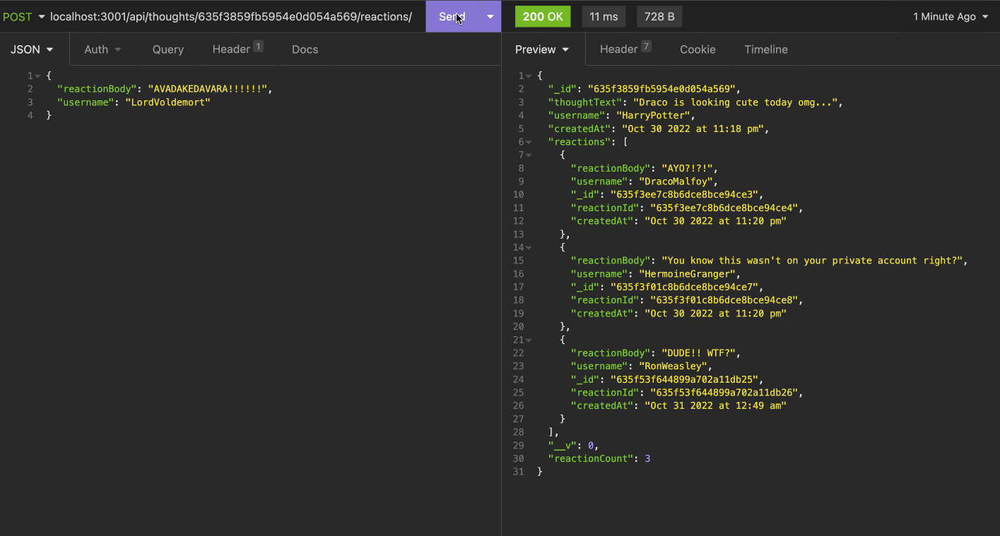

# Social-Network-API

## Description

This application is an API for a social networking web application users are created and they can share their thoughts, react to other users' thoughts, and add other users as a friend. This application utilizes `Express.js` for routing, a `MongoDB` database, the `Mongoose` ODM, and `Moment.js` to format timestamps. The seed data is created using `Insomnia`.

Here is a demonstration of how the API works using Insomnia:

To view the demonstration, click [♡ here ♡](https://streamable.com/lxvs7y)

## Table of Contents

- [Installation](#installation)
- [Usage](#usage)
- [Credits](#credits)
- [License](#license)

## Installation

The following packages are required to run this application: `express`, `moment`, and `mongoose`. 

Run the following command in the command line to initialize a new package:
~~~
npm init
~~~

To install the `express` package, run the following command:
~~~
npm install express
~~~
To install the `moment` package, run the following command:
~~~
npm install moment
~~~
And lastly, install the `mongoose` package by running the following command:
~~~
npm install mongoose
~~~

You will also need the `Insomnia` application is needed on the user's machine to run this application. For Insomnia installation instructions, click [♡ here ♡](https://docs.insomnia.rest/insomnia/install).

---
## Usage

1. This API uses MongoDB, a NoSQL database, allowing the application to handle large amounts of unstructured data.

2. When the command to start the application is entered, the Mongoose models are synced to the MongoDB database.

3. In Insomnia, the data for each of the routes is displayed in formatted JSON.

4. The **User**, **Friend**, **Thought**, and **Reaction** routes are created to create the database and for testing on Insomnia

5. **User Routes** - a user can create a user with a username and valid email address. When created, the user is assigned a unique user ID.

- To create a user, click the `POST` request and enter the user's username and email address. Click Send.

- There are two `GET` requests that return user information. To return all users, click the `Find All Users` request, then click on Send. To return a single user, click the `Find User by Id` request. On the URL, enter the user's ID.

- To update a user by ID, click the `PUT` request. On the URL, enter the ID of the user whose information is going to be updated.

- To delete a user by ID, click the `DELETE` request and enter the user's ID.
- A message that reads, `"User and thoughts deleted!"` will appear if the user has been deleted from the database. If there is no such user or user ID in the system, the message, `"No user with this id!"` is shown.

- Click `Find All Users` to see if the user has been deleted.

6. **Friend Routes** - a user can add a friend and delete a friend.

- To add a friend, click the `POST` request. On the URL enter the user ID of the user who is adding a friend, then the user ID of the friend the user is adding. \*(Note: Please see the section on Tests for the API routes.)\*

- To see the user's friends, click `Find All Users`. The ID of the friends the user added are listed under `"friends"`. The `"friendCount"` indicates the number of friends the user added.

- To remove or delete a friend, click the `DELETE` request. On the URL enter the user ID of the user who is deleting a friend, then the user ID of the friend the user is deleting.

- To check if the friend has been removed from the user's friend list, click `Find All Users`.

7. **Thought Routes** - a user can create a thought, get all thoughts or a single thought by ID, update a thought by ID, and delete a thought by ID.

- To create or add a thought, click the `POST` request. Enter the `"thoughtText"`, `"username"`, `"userID"` of the user creating the thought.

- To get all thoughts, click the `GET All Thoughts` request. All the thoughts that were created will appear, as well as the date and time they were created. Each created thought is assigned a unique thought ID. Click `GET All Users` to access the thought ID.

- To get a thought by ID, click the `GET Thought by Id` request and enter the thought ID.

- To update a thought, click the `PUT` request. On the URL, enter the thought ID. Enter the necessary changes on the text body. To see the changes, click `GET All Thoughts`.

- To delete a thought by ID, click the `DELETE` request. On the URL, enter the thought ID that will be deleted.

- When the thought is successfully deleted, the text can no longer be found when you try to access it by clicking `GET All Thoughts.` The thought ID is also deleted when you click `Find All Users.`

8. **Reaction Routes** - a user can create a reaction and delete a reaction.

- To create a reaction, click the `POST` request. On the URL, enter the ID of the thought the user is reacting or commenting on. Then enter the `"reactionBody"` and `"username"` of the user creating the reaction.

- Click on `GET All Thoughts`to see the reaction, the username of the user who created the reaction, the reaction ID, date and time the reaction is created, and the user's reaction count.

- To delete a reaction, click the `DELETE` request. On the URL, enter the ID of the thought the user created a reaction or commented on, then the reaction ID.

- The message, `"No thought with this id!"` will appear when a reaction is deleted or a reaction is not associated with a user ID.

9. MongoDB - After creating data on Insomnia, MongoDB also reflects the same data and changes that were made:

---
## License

This application is covered under the MIT license.
To view a description of this license type, refer to the repository or click [♡ here ♡](https://opensource.org/licenses/MIT).

---

## Badges

## About the Author

My name is Claire and I am a student learning Web Development.